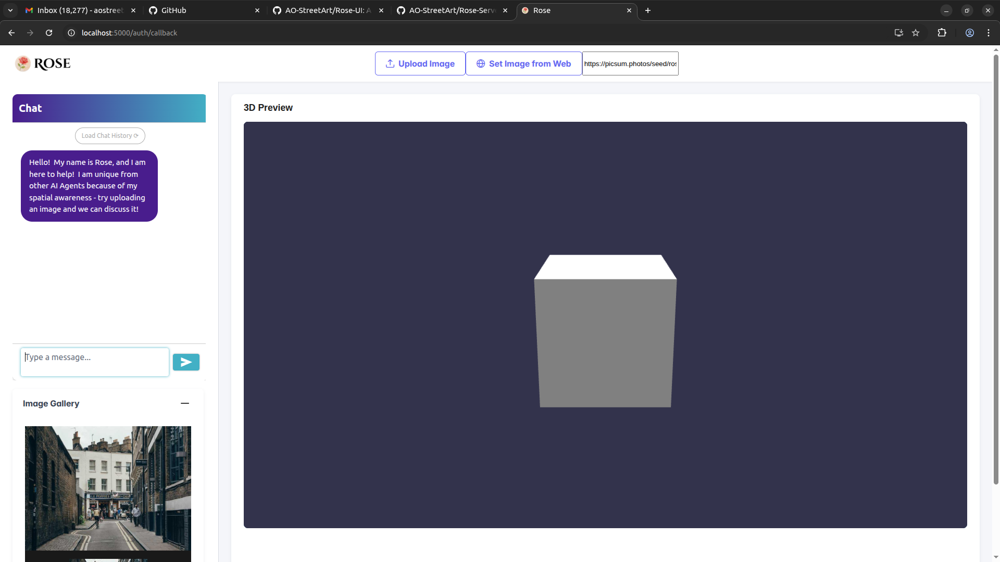

# Rose Server

Rose is an AI-enabled web application for searching, viewing, analyzing, and — most importantly — generating 3D scenes from images. The platform blends LLM-driven agent workflows, traditional retrieval and orchestration logic (e.g., web search, data lookups), computer vision models for perception, and state-of-the-art 3D asset generation pipelines such as TripoSR and 3DTopia. This repository contains the production web server that hosts the React front end, mediates authentication, and brokers ML workloads to AWS Bedrock and SageMaker.

## Platform Overview

- Supports multimodal ingestion: natural-language chat, uploaded 2D imagery, and scene metadata.
- Performs perception and understanding: detection/classification (e.g., VGG16, ResNet), depth estimation (Intel DPT), motion analysis, and structured spatial memory.
- Generates 3D content: image-to-3D reconstruction and texture synthesis via models such as TripoSR, 3DTopia, and optional advanced pipelines (TRELLIS, VGGT, Hunyuan3D 2.0, ControlNet-guided SDXL).
- Delivers an interactive workspace: the Rose UI provides a chat surface, 2D image viewer, and WebGL 3D viewer for inspection, comparison, and iteration.
- Orchestrates agentic workflows: an AWS Bedrock Agent coordinates reasoning steps, invokes SageMaker endpoints or custom Lambdas for specialized actions (e.g., segmentation, search), and returns structured traces for observability.

## System Architecture

### Major Components

- [`AO-StreetArt/Rose`](https://github.com/AO-StreetArt/Rose) — Core spatial intelligence library housing perception and reconstruction algorithms, Lambda implementations, and Docker images.
- `AO-StreetArt/Rose-Server` (this repo) — Flask backend that serves the compiled React application, applies Auth0-based access control, and proxies chat and ML requests to Bedrock/SageMaker.
- [`AO-StreetArt/Rose-UI`](https://github.com/AO-StreetArt/Rose-UI) — React single-page application with chat, 2D media review, and 3D scene visualization.

### Cloud Footprint

- **AWS Bedrock Agent** orchestrates reasoning steps with domain-specific Action Groups.
- **AWS SageMaker Endpoints** host high-value perception models (semantic segmentation, depth, reconstruction); transitioning workloads to Lambda is a cost-optimization target.
- **AWS Lambda** functions power lightweight agent actions such as web search, arithmetic, and glue logic.
- **Rose Server** is deployed behind an **Elastic Load Balancer**, with traffic managed via **Route53**.
- All internal services run inside a **VPC**; Rose Server is publicly exposed. HTTPS, OAuth 2.0, and JWTs (Auth0) enforce security boundaries.

## AI & ML Stack

- **Perception:** Detection/classification, depth estimation, and tracking across frames build a semantically rich scene graph.
- **Spatial Memory:** Short-term and long-term stores capture object properties, trajectories, and contextual cues for downstream reasoning.
- **3D Reconstruction:** Supports TripoSR and 3DTopia for rapid geometry generation, with extensibility for TRELLIS, VGGT, and Hunyuan3D 2.0.
- **Texture Generation:** ControlNet-guided SDXL pipelines produce high-quality texture maps when paired with UV layouts or inferred geometry.
- **Agent Tooling:** Bedrock Agent chains LLM reasoning with external capabilities (search, retrieval, CV inference) to answer spatial questions or trigger generation workflows.

## Repository Scope

Rose Server provides:

- Hosting for the compiled `rose-ui` React build.
- Auth0 JWT validation and optional gating for UI and health endpoints.
- A chat API (`POST /api/chat`) that forwards user prompts to the configured Bedrock Agent, streaming back messages and traces.
- Health and readiness probes for deployment orchestration.

## UI Snapshot



The SPA surfaces a chat-driven workflow alongside synchronized 2D and 3D viewers so engineers can review source imagery, inspect generated assets, and iterate quickly on prompts or tool invocations.

## Development Setup

### Prerequisites

- Python 3.11+
- Built React assets in `../rose-ui/build` (`npm install && npm run build`)
- Auth0 tenant with a configured API (audience) and SPA credentials
- AWS credentials with permission to invoke the target Bedrock Agent and related SageMaker endpoints

### Environment Variables

| Variable | Required | Description |
| --- | --- | --- |
| `AUTH0_DOMAIN` | ✅ | Auth0 domain (e.g. `your-tenant.us.auth0.com` or full `https://` URL) |
| `AUTH0_AUDIENCE` | ✅ | API audience configured in Auth0 |
| `AUTH0_CLIENT_ID` | ➖ | SPA Client ID to assert against the token `azp`/`client_id` claim (optional) |
| `BEDROCK_AGENT_ID` | ✅ | AWS Bedrock Agent identifier |
| `BEDROCK_AGENT_ALIAS_ID` | ✅ | Alias ID for the Bedrock Agent |
| `BEDROCK_REGION` | ➖ | AWS region for the Bedrock Agent (`us-east-1` default) |
| `REACT_BUILD_PATH` | ➖ | Override React build directory (defaults to `../rose-ui/build`) |
| `REQUIRE_AUTH_FOR_HEALTH` | ➖ | Set to `true` to enforce Auth0 auth on `/health/` |
| `REQUIRE_AUTH_FOR_UI` | ➖ | Set to `true` to force Auth0 auth before serving the SPA shell |

AWS credentials resolve via the standard [boto3 credential chain](https://boto3.amazonaws.com/v1/documentation/api/latest/guide/credentials.html).

### Install Dependencies

```bash
python -m venv .venv
source .venv/bin/activate
pip install -r requirements.txt
```

### Run the Server

```bash
export FLASK_APP=app:create_app
flask run --host 0.0.0.0 --port 5000
```

The server exposes:

- `GET /ping/` — lightweight readiness probe
- `GET /health/` — detailed health (optional auth)
- `POST /api/chat` — Auth0-protected proxy to the configured Bedrock Agent
- `GET /` and front-end routes — serve the SPA after verifying an Auth0 access token

### Chat Endpoint Contract

`POST /api/chat`

```jsonc
{
  "message": "User prompt",
  "sessionId": "optional-session-guid",
  "enableTrace": false
}
```

Response body:

```jsonc
{
  "sessionId": "resolved-session-id",
  "messages": [
    { "role": "assistant", "content": "..." }
  ],
  "trace": { "events": [...] } // present when enableTrace=true
}
```

## Deployment Notes

- Attach your Auth0-issued bearer token in the `Authorization: Bearer <token>` header for SPA and API requests.
- Rebuild the React assets on release and copy them into `rose-ui/build/` prior to deployment.
- For containerized deployments, bake the build artifacts and environment variables into the image or supply them at runtime.
